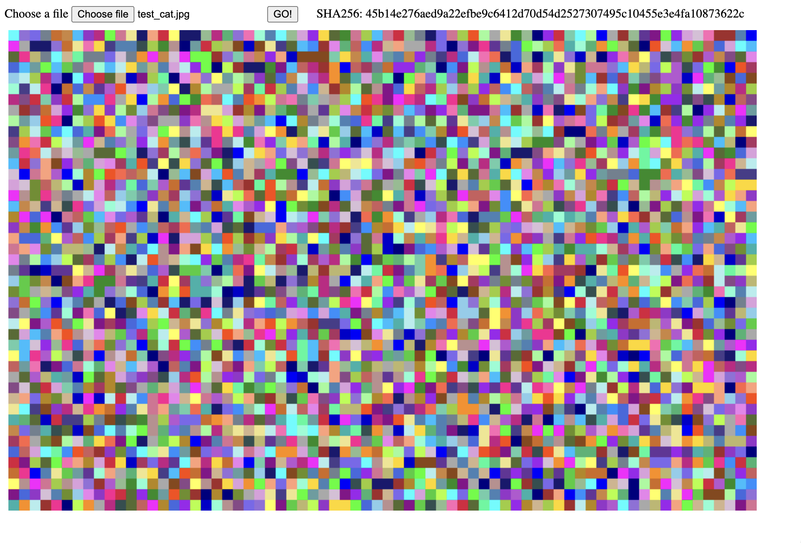

# FlashExfil

## Summary 



This tool is designed to help exifltration of files from remote desktops which block Copy and Paste or other exfiltration methods. This is achieved by encoding files into a series of colour grids, a Python script can then decode these grids back into the original file from a recording. 

During testing we have achieved a data transfer rate of 50KBs during the flashing phase, it is possible to run this tool at a higher rate with higher power machines.

**Note: This tool rapidly flashes coloured squares on a screen, if you suffer from a condition such as epilepsy, this may be unsuitable**

## Usage

### Overview

Typically using this program will consist of the following steps

- Use `typer.py` to type the `flash.html` file into your target machine over RDP or similar
- Use `typer.py` to type the `training.txt` file into your target machine over RDP or similar 
- Use `flash.html` to flash `training.txt` and record it with `collector.py`
- Use `decode.py` in training mode with the output of `flash.html` and `training_b64.txt` to train `decode.py` 
- Use `flash.html` to flash your target file and record it with `collector.py` 
- Use `decode.py` with the output of training and the `flash.html` to decode the output of `collector.py`
- You should now have the file exfiled 
- (Optional) Compare the SHA256 hash of the exfiled file with the value shown in `flash.html` to confirm it came out correctly

### Typing flash.html 

On your target machine (accessed via RDP, etc) open a text editor such as notepad, VSCode or Vim, then on your main machine run `typer.py` targeting `flash.html` 

```
$ python3 typer.py -f flash.html
```

You will have a few seconds (specified by the delay parameter, or default of 5) to click back into the text editor and give it focus.

Wait until the typer finishes and save `flash.html` as a HTML file (any name is okay)

### Typing training.txt

On your target machine (accessed via RDP, etc) open a text editor such as notepad, VSCode or Vim, then on your main machine run `typer.py` targeting `training.txt` 

```
$ python3 typer.py -f training.txt
```

You will have a few seconds (specified by the delay parameter, or default of 5) to click back into the text editor and give it focus.

Wait until the typer finishes and save `training.txt` as a HTML file (any name is okay)

Re-open the saved file, and make sure it is all on one line, some text editors automatically add another line. If this happened, remove the extra line break.

### Training the Tool

Training is used to ensure the colour matching used by this tool is calibrated, this is important as the compression of RDP and other remote desktop tools can cause variations from the hard-coded values used by default.

Now open `flash.html` in a browser, for testing, I was using Chrome on MacOS. 

Next, use the file selector to select training.txt, the SHA256 hash shown in `flash.html` should update and match the following:

```
8e29cddec596759961a22faeabb170e52bb83a7a9f4947395842b54e88784ed5
```

Next, we setup `collector.py`, ensure you have `flash.html` visible on your screen, the full black box should be visible with nothing overlapping.

```
$ python3 collector.py
```

The screen should dim slightly with a grey overlay. You can now drag and select the area to be recorded. This should be the black box of `flash.html` which indicates where the grids will be displayed. 

Click in the top-left of this, then drag to the bottom right, a red rectangle will be displayed showing the area you are selecting.

Once you have the area selected, release the left-mouse button, the output of `collector.py` should now say `Press enter to continue`. When you are ready, focus the terminal and press enter.

You now have 5 seconds (by default, this can be modified) before the recording starts, be ready to click "GO!" in `flash.html`. From this point ensure nothing covers the area you selected for recording, e.g notifications, your cursor, etc.

Once you see "Started recording" in the terminal, click "GO!", the grid should start flashing colours.

Carefully re-focus the terminal, ensuring nothing overlaps or covers the grid. 

You must now wait until the grid turns entirely white, indicating it has finished. At this point press `Ctrl-C` to stop the recording. 

The next step is to take the recording and use it to train the tool. 

```
$ python3 decode.py -t -r canvas_recording.mp4 -b64 training_b64.txt
```

You should see an output similar to the below:

```
[+] Extracting frames from video
[+] Detected first grid at frame 82
[+] Detected end grid at frame 99
[+] Extracted 17 grids after skipping 81 white frames
[+] Total unique grids matches expected of: 5
[+] Length of trained data matches known base64
[+] Learned colors for 65 characters
[+] Training complete
```

Importantly, you are looking for 

```
[+] Learned colors for 65 characters
```

If this value is not 65, and error may have occured. 

**Note: You should re-train for each RDP (or other remote desktop tool) you use, as the compression may change**

### Extracting a Real File

Assuming the training was successful, we are now able to extract real files. The flash and recording process is the same as for training, merely select the file you wish to exfil, record and flash it. 

Once you have a recording of a file you wish to decode, you can do so using the following command (Adjust the parameters as required)

```
$ python3 decode.py -r canvas_recording.mp4 -o out.jpg -cm color_mapping.json
```

You should see and output similar to the below 

```
[+] Loaded 65 color to character mappings
[+] Decoding video
[+] Detected first grid at frame 63
[+] Detected end grid at frame 704
[+] Found 163 unique grids
[+] Processed 100 of 163 grids
[+] Total file size: 383568 bytes
[+] SHA256 hash of decoded file: 45b14e276aed9a22efbe9c6412d70d54d2527307495c10455e3e4fa10873622c
[+] Decoded file to out.jpg
```

Assuming the SHA256 displayed in the output matches the SHA256 shown in `flash.html`, you should now have the exfiled file. 

### Help 

#### collector.py

```
$ python3 collector.py -h
usage: collector.py [-h] [-o OUTPUT] [-fps RECORDING_FPS] [-d DELAY]

options:
  -h, --help            show this help message and exit
  -o, --output OUTPUT   Path to save output file (Default = canvas_recording.mp4)
  -fps, --recording-fps RECORDING_FPS
                        Target FPS for recording (Default = 120)
  -d, --delay DELAY     Delay before recording starts in seconds (Default = 5, Minimum = 1)
```

#### decode.py

```
$ python3 decode.py -h
usage: decode.py [-h] -r RECORDING [-t] [-b64 BASE64] [-cm COLOR_MAPPINGS] [-dm] [-o OUTPUT] [-d]

options:
  -h, --help            show this help message and exit
  -r, --recording RECORDING
                        Path to recording of flashes
  -t, --train           Training mode
  -b64, --base64 BASE64
                        Path to known base64 for training
  -cm, --color-mappings COLOR_MAPPINGS
                        Path to save or load color mappings, default=color_mapping.json
  -dm, --use-default-mappings
                        Use default color mappings instead of trained file (decode mode only)
  -o, --output OUTPUT   Path to save output file
  -d, --debug           Print debug message
```

#### typer.py

```
$ python3 typer.py -h
usage: typer.py [-h] -f FILE [-c] [-cs CHUNK_SIZE] [-d DELAY] [-i INTERVAL]

options:
  -h, --help            show this help message and exit
  -f, --file FILE       Input file to type
  -c, --chunk           Chunk typing file content, for use if typing large files
  -cs, --chunk-size CHUNK_SIZE
                        Number of characters per chunk for use with --chunk (Default = 100, Minimum = 1)
  -d, --delay DELAY     Delay before typing starts in seconds (Default = 5, Minimum = 1)
  -i, --interval INTERVAL
                        Interval between key presses (Default = 0, Minimum = 0)
```

## Installation

This tool was tested on MacOS 26 using Python 3.14.0, the following additional Python modules are required and should be installed with pip:

- mss 
- imageio 
- imageio\[ffmpeg\]
- pyautogui
- cv2

## Files in Project

### collector.py

This script allows specifying an area of the screen to record and is used to record the flashing grids for later decoding.

### decode.py

This script processes the recordings generated by the collector script. First allowing traiing of the color model, then decoding the flashes back into files.

### typer.py

This script allows the user to "type" the contents of files automatically, and is designed to allow you to load the training file and flash HTML into a remote machine the does not allow copy and paste.

### flash.html

This HTML file allows the user to select files, it will then base64 encode them and display them as a series of coloured flashing grids for later decoding.

### training.txt

A plaintext file with known base64 to train the decoder. 

### training_b64.txt

The known base64 for training.txt used to train the decoder.

### test_cat.jpg

An extra file to test the tool with. 

## Limitations and Tweaks

- Each grid is displayed for 3 frames, this was suitable on my test system, if you have issues with decoding it is possible your machine is recording at too low of an FPS, and this may need to be increased
- Javascripts canvas FPS targets your monitor refresh rate, therefore, high refresh rate monitors are more liable to strugle at the 3 frames per grid default
- If you make a new training file, with the known base64 ensure there is no extra newline in the file, it should all be on one line

## Upcoming 

An alternative version of this tool that encodes grids of QR codes to allow a higher data transfer rate will be released in the near future. 